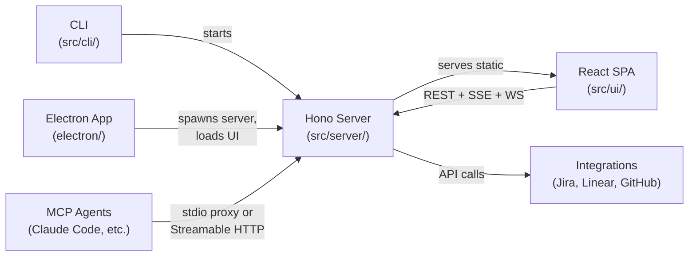
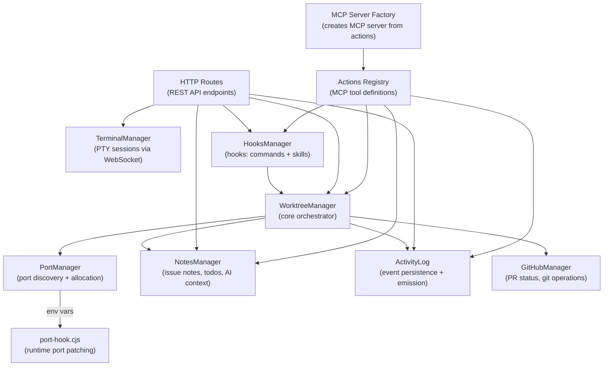
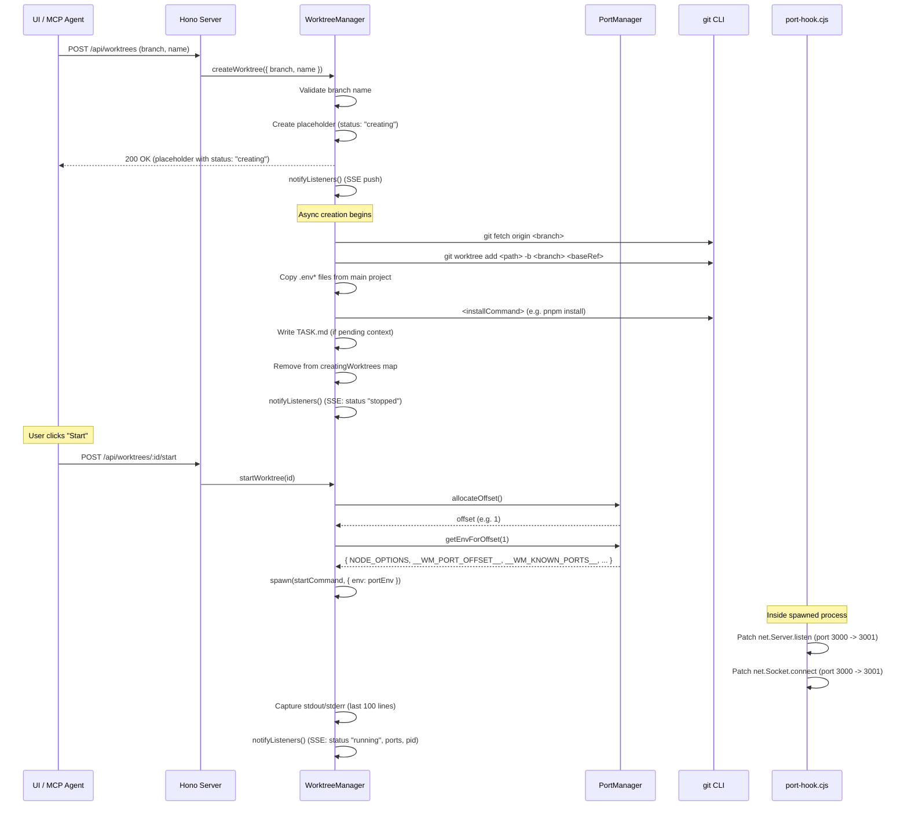

# Architecture Overview

## System Overview

dawg is a CLI tool, web UI, and optional Electron desktop app for managing multiple git worktrees with automatic port offsetting. It solves the problem of port conflicts when running multiple dev server instances concurrently by monkey-patching Node.js `net.Server.listen` and `net.Socket.connect` at runtime via `--require`.

The system is organized into three primary layers:

1. **CLI** -- The entry point. Routes subcommands (`init`, `mcp`, `task`, `add`), starts the HTTP server, and opens the UI in Electron or a browser.
2. **Server** -- A Hono-based HTTP server that exposes a REST API, SSE event streams, WebSocket terminals, and a Streamable HTTP MCP transport. All state is managed here.
3. **Clients** -- The React SPA (web UI), the Electron shell, and MCP agents (e.g. Claude Code) all connect to the same server instance.

## System Layers



The CLI starts the Hono server, which then serves the React SPA as static files. The Electron app spawns a separate server process per project and loads the UI in a BrowserWindow. MCP agents connect either through stdio (proxy mode relaying to the running server) or directly via Streamable HTTP transport at `/mcp`.

## Core Components



### WorktreeManager

`src/server/manager.ts` -- The central orchestrator. Manages the lifecycle of git worktrees: creation (with async status updates via SSE), starting/stopping dev processes, removal, and renaming. It owns instances of `PortManager` and `NotesManager`, and optionally initializes `GitHubManager` for PR tracking and git operations.

Key responsibilities:

- **Worktree CRUD**: `createWorktree()`, `removeWorktree()`, `renameWorktree()`, `recoverWorktree()`
- **Process management**: `startWorktree()` spawns the dev command with port-offset env vars; `stopWorktree()` sends SIGTERM
- **SSE notification**: Maintains a set of event listeners and calls `notifyListeners()` on every state change
- **Issue integration**: `createWorktreeFromJira()` and `createWorktreeFromLinear()` fetch issue data, generate a branch name, write `TASK.md`, and link the issue to the worktree
- **Config management**: `reloadConfig()`, `updateConfig()`, `getConfig()`
- **Log capture**: Stdout/stderr from spawned processes is captured (last 100 lines) and forwarded to listeners with debounced batching (250ms)
- **Activity tracking**: Owns an `ActivityLog` instance, emitting lifecycle events (`creation_started`, `creation_completed`, `creation_failed`, `started`, `stopped`, `crashed`) during worktree operations

### PortManager

`src/server/port-manager.ts` -- Handles port discovery, offset allocation, and environment variable generation.

Key responsibilities:

- **Port discovery**: `discoverPorts()` spawns the project's start command, waits for stabilization (15 seconds), walks the process tree via `pgrep`, and scans for listening ports via `lsof`
- **Offset allocation**: `allocateOffset()` hands out sequential multiples of `offsetStep` (e.g., 1, 2, 3...); `releaseOffset()` frees them
- **Env var generation**: `getEnvForOffset()` builds the environment variables that activate the port hook: `NODE_OPTIONS` (with `--require port-hook.cjs`), `__WM_PORT_OFFSET__`, `__WM_KNOWN_PORTS__`, plus any user-defined `envMapping` templates
- **Env mapping detection**: `detectEnvMapping()` scans `.env*` files for references to discovered ports and generates template strings like `http://localhost:${3000}`
- **Persistence**: Discovered ports and env mappings are written back to `.dawg/config.json`

### TerminalManager

`src/server/terminal-manager.ts` -- Manages interactive PTY (pseudo-terminal) sessions that connect to the web UI via WebSockets.

Key responsibilities:

- **Session lifecycle**: `createSession()` registers a session; `attachWebSocket()` spawns the PTY process (using `node-pty`) and wires bidirectional data flow between the WebSocket and the PTY
- **Resize handling**: JSON messages with `{ type: "resize", cols, rows }` are intercepted and forwarded to `pty.resize()`
- **Cleanup**: `destroySession()`, `destroyAllForWorktree()`, `destroyAll()` handle teardown of PTY processes and WebSocket connections

### NotesManager

`src/server/notes-manager.ts` -- Manages per-issue metadata stored as JSON files under `.dawg/issues/{source}/{issueId}/notes.json`.

Stored data per issue:

- **linkedWorktreeId**: Which worktree is associated with this issue
- **personal**: Free-text notes (private to the user, not exposed to agents)
- **aiContext**: Directions for AI agents working on this issue
- **todos**: A checklist of sub-tasks with `id`, `text`, `checked`, and `createdAt`
- **gitPolicy**: Per-issue overrides for agent git permissions (`agentCommits`, `agentPushes`, `agentPRs`)

The `buildWorktreeLinkMap()` method scans all notes files to produce a reverse map from worktree IDs to their linked issues -- used by `WorktreeManager.getWorktrees()` to enrich worktree info with issue metadata.

### ActivityLog

`src/server/activity-log.ts` -- Persists and broadcasts activity events (agent actions, worktree lifecycle, git operations) to SSE listeners.

Key responsibilities:

- **Event persistence**: Events are appended to `.dawg/activity.json` in JSONL format (one JSON object per line)
- **Real-time broadcast**: Maintains a set of subscriber callbacks, notified on every new event
- **Querying**: `getEvents(filter?)` supports filtering by category, timestamp, and limit
- **Pruning**: Removes events older than the configured retention period (default 7 days), runs on startup and every hour
- **Toast/notification classification**: `isToastEvent()` and `isOsNotificationEvent()` check events against configurable event type lists

Shared types are defined in `src/server/activity-event.ts`: `ActivityCategory` (`agent` | `worktree` | `git` | `integration` | `system`), `ActivitySeverity` (`info` | `success` | `warning` | `error`), `ActivityEvent`, and the `ACTIVITY_TYPES` event catalog.

### HooksManager

`src/server/verification-manager.ts` -- Manages automated checks and agent skills organized by trigger type. Contains two item types:

1. **Command steps**: Shell commands (lint, typecheck, build) that run in the worktree directory. Each step has a trigger type, can be enabled/disabled, and custom-trigger steps include a natural-language condition.
2. **Skill references**: References to skills from the `~/.dawg/skills/` registry. The same skill can be used in multiple trigger types (identified by `skillName + trigger` composite key). Skills support per-issue overrides (inherit/enable/disable).

Four trigger types: `pre-implementation` (before agent work), `post-implementation` (after agent work), `custom` (agent decides based on condition), `on-demand` (manually triggered).

Command step runs are persisted to `.dawg/worktrees/{id}/hooks/latest-run.json`. Skill results reported by agents are stored at `.dawg/worktrees/{id}/hooks/skill-results.json`.

Hooks are configured via `.dawg/hooks.json` with `steps` and `skills` arrays.

## Data Flow

### 1. Worktree Creation, Port Allocation, and Process Spawn



The creation is asynchronous -- the HTTP response returns immediately with a placeholder entry (status `"creating"`) so the UI can show progress. The actual `git worktree add`, dependency installation, and `TASK.md` generation happen in the background, with status updates pushed via SSE.

### 2. MCP Tool Calls

MCP agents communicate with dawg through two modes:

**Proxy mode** (preferred when the server is running): The `dawg mcp` command detects a running server via `.dawg/server.json`, then relays JSON-RPC messages between stdio (connected to Claude Code) and the server's Streamable HTTP transport at `/mcp`. This ensures the agent shares state with the UI.

**Standalone mode** (fallback): If no server is running, `dawg mcp` creates its own `WorktreeManager` instance and serves MCP tools directly over stdio.

The tool definitions live in `src/actions.ts` as a flat array of `Action` objects. Each action has a name, description, parameter schema, and async handler function. The `MCP Server Factory` (`src/server/mcp-server-factory.ts`) converts these into MCP tools with Zod schemas. The same actions are used for both the Streamable HTTP MCP transport (exposed at `/mcp` on the server) and the standalone stdio MCP server.

### 3. Terminal Sessions

Terminal sessions use a two-step protocol:

1. **Create session**: `POST /api/worktrees/:id/terminal` returns a `sessionId`
2. **Attach WebSocket**: `GET /api/terminal/:sessionId/ws` upgrades to WebSocket

Once attached, the `TerminalManager` spawns a PTY process (`node-pty`) in the worktree directory. Data flows bidirectionally: keystrokes from the WebSocket are written to the PTY; PTY output is sent back over the WebSocket. Resize messages (`{ type: "resize", cols, rows }`) are intercepted and forwarded to `pty.resize()`.

## Build System

dawg uses a dual build system to produce the backend and frontend artifacts:

### Backend: tsup (ESM)

Configuration lives in `tsup.config.ts` at the project root:

```typescript
export default defineConfig({
  entry: ["src/cli/index.ts", "src/electron-entry.ts"],
  format: "esm",
  external: ["node-pty", "electron"],
  esbuildOptions(options) {
    options.loader = { ...options.loader, ".md": "text" };
  },
});
```

This bundles two entry points:

- `src/cli/index.ts` -- The CLI entry point (produces `dist/cli/index.js`)
- `src/electron-entry.ts` -- The Electron IPC bridge entry point

Both are output as ESM. `node-pty` and `electron` are externalized since they contain native bindings that cannot be bundled.

The `.md` text loader inlines markdown files as strings at build time. This is used by the `src/instructions/` directory to keep agent instruction text in standalone `.md` files rather than embedded template literals. See the [Instructions section](#agent-instructions) below.

### Frontend: Vite (React SPA)

```
vite build
```

Vite builds the React SPA from `src/ui/` into `dist/ui/`. The Hono server serves these static files, and the Electron app loads `dist/ui/index.html` directly.

### Electron: tsc + electron-builder

The Electron main process (`electron/main.ts`) is compiled with `tsc -p electron/tsconfig.json` into `dist/electron/main.js`. The preload script (`electron/preload.cjs`) is copied as-is. `electron-builder` packages everything into a macOS `.app` bundle.

### Runtime artifact: port-hook.cjs

`src/runtime/port-hook.cjs` is a pure CommonJS file with zero dependencies. It is copied verbatim to `dist/runtime/port-hook.cjs` during the build. It cannot be bundled because it must be loadable via Node's `--require` flag in any process.

### Full build pipeline

```
pnpm build
```

This runs sequentially:

1. tsup -- bundle backend ESM entries
2. tsc -- compile Electron main process
3. cp -- copy preload.cjs and port-hook.cjs
4. vite build -- bundle the React SPA

## Directory Structure

```
src/
├── cli/               CLI entry point and subcommands
│   ├── index.ts         Main CLI router (start, init, mcp, task, add)
│   ├── config.ts        Config file discovery and loading
│   ├── init.ts          Interactive setup wizard
│   ├── add.ts           Integration setup (github, jira, linear)
│   ├── install-app.ts   Auto-install desktop app from GitHub Releases
│   └── task.ts          Create worktree from issue ID
├── server/            Hono HTTP server, managers, and routes
│   ├── index.ts         Server creation, startup, server.json write
│   ├── manager.ts       WorktreeManager (core orchestrator)
│   ├── port-manager.ts  Port discovery and offset allocation
│   ├── terminal-manager.ts  PTY session management
│   ├── notes-manager.ts     Issue notes, todos, AI context
│   ├── verification-manager.ts  HooksManager (commands + skills by trigger type)
│   ├── activity-event.ts  Shared activity event types and constants
│   ├── activity-log.ts    Activity event persistence and emission
│   ├── mcp-server-factory.ts   Creates MCP server from actions registry
│   ├── git-policy.ts    Agent git permission resolution
│   ├── branch-name.ts   Branch name generation from rules
│   ├── commit-message.ts  Commit message formatting
│   ├── task-context.ts  TASK.md generation
│   ├── types.ts         Core type definitions
│   └── routes/          API route handlers
│       ├── worktrees.ts   CRUD + start/stop/rename/recover
│       ├── config.ts      Configuration read/update
│       ├── events.ts      SSE event stream
│       ├── terminal.ts    WebSocket terminal sessions
│       ├── github.ts      GitHub PR operations
│       ├── jira.ts        Jira issue operations
│       ├── linear.ts      Linear issue operations
│       ├── notes.ts       Notes/todos CRUD
│       ├── tasks.ts       Task context and local issues
│       ├── activity.ts    Activity feed query endpoint
│       ├── mcp.ts         MCP configuration endpoints
│       ├── mcp-transport.ts  Streamable HTTP MCP transport
│       ├── mcp-servers.ts    External MCP server management
│       ├── skills.ts      Agent skill definitions
│       ├── claude-plugins.ts  Claude-specific plugin endpoints
│       └── verification.ts   Hooks endpoints (config, steps, skills, runs)
├── ui/                React frontend (SPA)
│   ├── index.html       HTML entry point
│   ├── main.tsx         React app bootstrap
│   ├── App.tsx          Root component (workspace/config/integrations views)
│   ├── theme.ts         Centralized design tokens
│   ├── types.ts         Frontend type definitions
│   ├── contexts/        React context providers
│   ├── components/      UI components
│   │   ├── ActivityFeed.tsx Activity feed dropdown with bell icon
│   │   ├── Header.tsx     Top bar (project name, connection, activity bell)
│   │   ├── CreateForm.tsx   Worktree creation form
│   │   ├── WorktreeList.tsx, WorktreeItem.tsx
│   │   ├── JiraIssueList.tsx, JiraIssueItem.tsx
│   │   ├── LinearIssueList.tsx, LinearIssueItem.tsx
│   │   ├── CustomTaskList.tsx, CustomTaskItem.tsx
│   │   ├── IntegrationsPanel.tsx
│   │   ├── Modal.tsx, ConfirmModal.tsx, ConfirmDialog.tsx
│   │   └── detail/      Right-panel detail views
│   │       ├── DetailPanel.tsx        Worktree detail (logs, terminal, git)
│   │       ├── JiraDetailPanel.tsx    Jira issue detail
│   │       ├── LinearDetailPanel.tsx  Linear issue detail
│   │       ├── CustomTaskDetailPanel.tsx
│   │       ├── LogsViewer.tsx         Process output viewer
│   │       ├── ActionToolbar.tsx      Git operations toolbar
│   │       ├── GitActionInputs.tsx    Commit/push/PR inputs
│   │       └── TodoList.tsx           Checklist component
│   └── hooks/           React hooks
│       ├── api.ts         Raw API client functions
│       ├── useApi.ts      Server-URL-bound API hook
│       ├── useWorktrees.ts   SSE connection for real-time updates
│       ├── useConfig.ts
│       ├── useNotes.ts
│       ├── useJiraIssues.ts, useJiraIssueDetail.ts
│       ├── useLinearIssues.ts, useLinearIssueDetail.ts
│       ├── useCustomTasks.ts, useCustomTaskDetail.ts
│       ├── useActivityFeed.ts  Activity feed state and SSE integration
│       ├── useTerminal.ts   WebSocket terminal connection
│       ├── useMcpServers.ts
│       ├── useSkills.ts
│       └── useHooks.ts
├── integrations/      External service integrations
│   ├── github/          GitHub via `gh` CLI
│   │   ├── gh-client.ts   Low-level gh CLI wrapper
│   │   ├── github-manager.ts  PR tracking, git operations, polling
│   │   └── types.ts
│   ├── jira/            Jira Cloud API
│   │   ├── auth.ts        OAuth + API token authentication
│   │   ├── api.ts         Issue fetching, attachment download
│   │   ├── credentials.ts Credential loading/saving
│   │   ├── adf-to-markdown.ts  Atlassian Document Format converter
│   │   └── types.ts
│   └── linear/          Linear GraphQL API
│       ├── api.ts         Issue fetching and search
│       ├── credentials.ts Credential loading/saving
│       └── types.ts
├── instructions/      Agent instruction text (markdown, inlined at build time)
│   ├── index.ts         Barrel export with placeholder interpolation
│   ├── mcp-server.md    MCP server instructions
│   ├── mcp-work-on-task.md  work-on-task MCP prompt template
│   ├── agents/          IDE agent instruction files
│   │   ├── shared-workflow.md  Shared workflow fragment
│   │   ├── claude-skill.md     Claude Code SKILL.md
│   │   ├── cursor-rule.md      Cursor rule template
│   │   └── vscode-prompt.md    VS Code prompt template
│   └── skills/          Predefined hook skills (SKILL.md format)
│       ├── summarize-changes.md
│       ├── review-changes.md
│       ├── draft-test-plan.md
│       ├── write-tests.md
│       └── explain-like-im-5.md
├── runtime/           Runtime artifacts (not bundled)
│   └── port-hook.cjs    Node.js require hook for port offsetting
├── core/              Shared core utilities
│   ├── git.ts           Git helper functions
│   └── env-files.ts     .env file copying between worktrees
├── shared/            Cross-process shared code
│   ├── detect-config.ts   Config file detection
│   └── global-preferences.ts  Global app preferences
├── actions.ts         MCP action definitions (tool registry)
├── constants.ts       App-wide constants
├── logger.ts          Logging utility
└── electron-entry.ts  Electron IPC bridge entry point

website/               Public landing page (Astro static site)
├── src/
│   ├── layouts/         Base HTML layout
│   ├── pages/           Page routes (index.astro)
│   ├── components/      Nav, Hero, Features, HowItWorks, Download, Footer
│   ├── scripts/         Client-side JS (GitHub API, arch detection, clipboard)
│   └── styles/          Global CSS variables and animations
└── public/              Static assets (icon.svg)

electron/              Electron desktop app
├── main.ts              Main process (window, tray, IPC, protocol)
├── preload.cjs          Context bridge for renderer
├── server-spawner.ts    Spawn/stop dawg server per project
├── project-manager.ts   Multi-project tab management
├── notification-manager.ts  Native OS notifications from SSE activity streams
├── preferences-manager.ts  App preferences persistence
└── tsconfig.json        Electron-specific TypeScript config
```

## Agent Instructions

Agent instruction text (MCP instructions, IDE skill/rule files, hook skill definitions) lives in `src/instructions/` as standalone `.md` files. The tsup esbuild text loader (`{ '.md': 'text' }`) inlines them as strings at build time.

### How it works

1. Each instruction is a `.md` file under `src/instructions/` (or subdirectories `agents/`, `skills/`)
2. `src/instructions/index.ts` imports all `.md` files, resolves placeholders, and exports typed constants
3. Consumer files (`actions.ts`, `mcp-server-factory.ts`, `builtin-instructions.ts`, `verification-skills.ts`) import from the barrel
4. `src/md.d.ts` provides TypeScript declarations for `*.md` imports

### Placeholders

| Placeholder    | Resolved                          | Value                                  |
| -------------- | --------------------------------- | -------------------------------------- |
| `{{APP_NAME}}` | At module load time in `index.ts` | `APP_NAME` constant ("dawg")           |
| `{{WORKFLOW}}` | At module load time in `index.ts` | Content of `agents/shared-workflow.md` |
| `{{ISSUE_ID}}` | At runtime by the caller          | Function argument (e.g. "PROJ-123")    |

### File map

| File                        | Export                    | Used by                                                            |
| --------------------------- | ------------------------- | ------------------------------------------------------------------ |
| `mcp-server.md`             | `MCP_INSTRUCTIONS`        | `mcp-server-factory.ts` (server instructions)                      |
| `mcp-work-on-task.md`       | `MCP_WORK_ON_TASK_PROMPT` | `mcp-server-factory.ts` (prompt template)                          |
| `agents/claude-skill.md`    | `CLAUDE_SKILL`            | `builtin-instructions.ts` (deployed to `~/.claude/skills/`)        |
| `agents/cursor-rule.md`     | `CURSOR_RULE`             | `builtin-instructions.ts` (deployed to `.cursor/rules/`)           |
| `agents/vscode-prompt.md`   | `VSCODE_PROMPT`           | `builtin-instructions.ts` (deployed to `.github/prompts/`)         |
| `agents/shared-workflow.md` | _(internal)_              | Interpolated into cursor-rule and vscode-prompt via `{{WORKFLOW}}` |
| `skills/*.md`               | `PREDEFINED_SKILLS`       | `verification-skills.ts` (deployed to `~/.dawg/skills/`)           |

## Server-as-Hub Pattern

The Hono server acts as a central hub. All clients -- the React SPA, the Electron shell, and MCP agents -- connect to the same server instance and share the same state.

The server writes a `server.json` file to `.dawg/server.json` on startup:

```json
{
  "url": "http://localhost:6969",
  "pid": 12345
}
```

This file enables **agent discovery**: when `dawg mcp` starts, it reads `server.json`, checks if the process is alive (via `process.kill(pid, 0)`), and if so, enters **proxy mode** -- relaying JSON-RPC messages between stdio and the server's `/mcp` endpoint. This means an MCP agent and the web UI always see the same worktree state, running processes, and logs.

If no server is running (e.g., the agent is invoked before the user starts the UI), `dawg mcp` falls back to **standalone mode** with its own `WorktreeManager`.

The Electron app uses a similar pattern: `electron/server-spawner.ts` spawns a `dawg` CLI process per project (with `--no-open` to suppress browser opening), polls until the server is ready, then loads the UI at the server URL. The `electron/project-manager.ts` handles multi-project tabs, each backed by its own server process.

`server.json` is cleaned up on graceful shutdown (SIGINT/SIGTERM).

## Configuration Discovery

Configuration is loaded from `.dawg/config.json`. The config loader walks up the directory tree from `process.cwd()` looking for a `.dawg/` directory containing `config.json`. This allows running `dawg` from any subdirectory within a project.

For full details on configuration options and format, see [CONFIGURATION.md](./CONFIGURATION.md).
