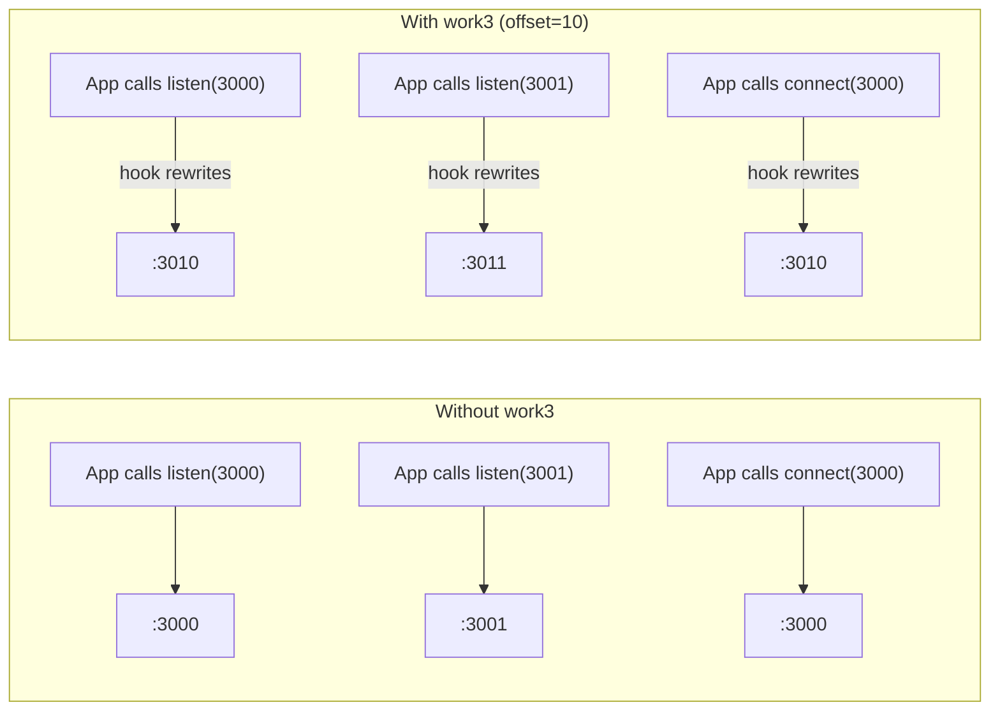

# Port Mapping and Offsetting

## Overview

When you run multiple instances of a dev server simultaneously -- one per git worktree -- they all try to bind the same ports and fail. work3 solves this by discovering which ports your application uses, then transparently offsetting them for each worktree instance at runtime.

The mechanism is fully automatic: once ports are discovered, every worktree process launched by work3 has its `net.Server.listen` and `net.Socket.connect` calls monkey-patched so that known base ports are shifted by a per-worktree offset. No changes to application code are required.

## Port Discovery

### How it works

Port discovery runs your project's `startCommand` in the main project directory, waits for the process tree to stabilize (15 seconds), then uses OS-level tools to find every TCP port the process tree is listening on.

The sequence:

1. **Spawn the dev command** -- `PortManager.discoverPorts()` runs the configured `startCommand` (e.g. `pnpm dev`) in a detached process group.
2. **Wait for stabilization** -- After spawning, it waits 15 seconds (`DISCOVERY_STABILIZE_MS`) for all servers in the process tree to start listening.
3. **Walk the process tree** -- Uses `pgrep -P <pid>` recursively to find all child PIDs descended from the spawned process.
4. **Scan for listening ports** -- Runs `lsof -P -n -iTCP -sTCP:LISTEN -a -p <pid_list>` to find all TCP ports in LISTEN state across the process tree.
5. **Kill the discovery process** -- Sends `SIGTERM` to the process group, waits 2 seconds, then `SIGKILL` if still alive.
6. **Persist results** -- Discovered ports are saved to `.work3/config.json` under `ports.discovered`.
7. **Auto-detect env mappings** -- After discovery, scans all `.env*` files in the project for values containing discovered ports and builds a template mapping (see [Environment Variable Mapping](#environment-variable-mapping)).

### API endpoints

| Method | Path | Description |
|--------|------|-------------|
| `GET` | `/api/ports` | Returns current `discovered` ports and `offsetStep` |
| `POST` | `/api/discover` | Triggers a full port discovery run. Returns discovered ports and logs. |
| `POST` | `/api/detect-env` | Re-scans `.env*` files for port references and updates `envMapping` |

### What gets stored

In `.work3/config.json`:

```json
{
  "ports": {
    "discovered": [3000, 3001, 4000],
    "offsetStep": 1
  },
  "envMapping": {
    "VITE_API_URL": "http://localhost:${4000}/api"
  }
}
```

The `discovered` array contains the base ports your application listens on. The `offsetStep` controls the gap between worktree offsets (typically `1`).

## Offset Allocation Algorithm

When a worktree is started, `PortManager.allocateOffset()` assigns the next available offset. The algorithm:

1. Start at `offset = offsetStep`.
2. If that offset is already in use by another running worktree, increment by `offsetStep`.
3. Repeat until a free offset is found.
4. Mark the offset as used.

When a worktree process exits (or is stopped), `PortManager.releaseOffset()` returns that offset to the pool so it can be reused.

### Example with `offsetStep: 10`

If the application's base ports are `[3000, 3001]`:

| Worktree | Offset | Mapped Ports |
|----------|--------|--------------|
| main repo | 0 | 3000, 3001 (unmodified) |
| feature-a | 10 | 3010, 3011 |
| feature-b | 20 | 3020, 3021 |
| feature-c | 30 | 3030, 3031 |

If `feature-a` is stopped, offset 10 becomes available. The next worktree started will reuse offset 10.

### Example with `offsetStep: 1` (default)

| Worktree | Offset | Mapped Ports |
|----------|--------|--------------|
| main repo | 0 | 3000, 3001 |
| feature-a | 1 | 3001, 3002 |
| feature-b | 2 | 3002, 3003 |

Note: with `offsetStep: 1` and multiple base ports, the offset ranges can overlap (3001 appears in both the base ports and feature-a's ports). Use a larger `offsetStep` if your application listens on multiple ports. A safe rule of thumb: set `offsetStep` to at least the number of discovered ports.

## Runtime Hook (`port-hook.cjs`)

This is the core innovation that makes transparent port offsetting work. It is a pure CommonJS file with zero dependencies, loaded into every worktree process at startup via Node.js's `--require` flag.

### How it gets injected

When `PortManager.getEnvForOffset()` builds the environment for a worktree process, it constructs:

```
NODE_OPTIONS="--require /path/to/port-hook.cjs"
```

This causes Node.js to execute `port-hook.cjs` before the application's entry point, giving the hook a chance to patch `net.Server` and `net.Socket` before any application code runs.

The spawned process also receives these environment variables:

| Variable | Type | Description |
|----------|------|-------------|
| `__WM_PORT_OFFSET__` | integer | The offset for this worktree (e.g. `10`) |
| `__WM_KNOWN_PORTS__` | JSON array | Base ports to intercept (e.g. `[3000,3001]`) |
| `__WM_DEBUG__` | any | If set, logs every intercepted `listen` call to stdout |

### What it patches

The hook only activates if both `__WM_PORT_OFFSET__` is greater than 0 and `__WM_KNOWN_PORTS__` contains at least one port. When active, it monkey-patches two methods on Node.js's `net` module:

#### `net.Server.prototype.listen`

Intercepts all incoming port bindings. When the application calls `server.listen(port)` and `port` is in the known ports set, the hook rewrites the call to `server.listen(port + offset)`.

Handles two calling conventions:
- **Positional:** `listen(port, [host], [backlog], [cb])` -- `args[0]` is a number
- **Options object:** `listen({ port, host, ... }, [cb])` -- `args[0].port` is read and replaced

#### `net.Socket.prototype.connect`

Intercepts all outgoing connections. This is critical for cases where one part of your application connects to another (e.g. a frontend dev server proxying to an API server). Without this patch, inter-service connections within the same worktree would still target the base ports.

Handles three calling conventions:
- **Positional:** `connect(port, [host], [cb])` -- port is a number as `args[0]`
- **Array form:** `connect([{ port, host }, cb])` -- used internally by Node.js HTTP agent
- **Options object:** `connect({ port, host }, [cb])` -- plain options

Only connections to **localhost addresses** are offset. The hook recognizes: `127.0.0.1`, `::1`, `localhost`, `0.0.0.0`, and empty string (which Node.js treats as localhost). Connections to remote hosts are passed through unmodified.

### Flow diagram



### Worked example

Given this configuration:

```json
{
  "ports": { "discovered": [3000, 4000], "offsetStep": 10 }
}
```

Worktree `feature-login` is started and assigned offset 10. The spawned process receives:

```bash
NODE_OPTIONS="--require /abs/path/to/port-hook.cjs"
__WM_PORT_OFFSET__=10
__WM_KNOWN_PORTS__=[3000,4000]
```

At runtime:
- `express().listen(3000)` is rewritten to `listen(3010)`
- `express().listen(4000)` is rewritten to `listen(4010)`
- `fetch("http://localhost:3000/api")` (which internally calls `net.Socket.connect({ port: 3000 })`) is rewritten to connect to port `3010`
- `fetch("https://api.example.com:3000")` is **not** rewritten because the host is not localhost

## Environment Variable Mapping

Many applications read port numbers from environment variables (e.g. `DATABASE_URL`, `VITE_API_URL`). The runtime hook patches `net.Server.listen` and `net.Socket.connect`, but it cannot patch string-level port references in environment variables. The `envMapping` feature handles this.

### How detection works

After port discovery, `PortManager.detectEnvMapping()` scans all `.env*` files (recursively, excluding `node_modules` and `.git`) in the project directory. For each file, it:

1. Parses lines as `KEY=VALUE` pairs (skipping comments and blank lines).
2. Strips surrounding quotes from values.
3. Checks if the value contains any discovered port number as a substring.
4. If it does, replaces each port occurrence with `${port}`, creating a template.

### Template syntax

The template uses `${port}` where `port` is the **base** port number. At spawn time, each `${port}` is replaced with `port + offset`.

Example `.env` file:

```
DATABASE_URL=postgres://localhost:5432/mydb
VITE_API_URL=http://localhost:3000/api
REDIS_URL=redis://localhost:6379
```

If ports `[3000, 5432]` are discovered, the resulting `envMapping`:

```json
{
  "DATABASE_URL": "postgres://localhost:${5432}/mydb",
  "VITE_API_URL": "http://localhost:${3000}/api"
}
```

Note that `REDIS_URL` is not included because port 6379 was not in the discovered ports list.

For a worktree with offset 10, the spawned process receives:

```
DATABASE_URL=postgres://localhost:5442/mydb
VITE_API_URL=http://localhost:3010/api
```

### Manual configuration

You can also define `envMapping` manually in `.work3/config.json` for cases where auto-detection misses something, or where env vars are not defined in `.env` files:

```json
{
  "envMapping": {
    "API_PORT": "${3000}",
    "WEBPACK_DEV_SERVER": "http://localhost:${8080}",
    "FULL_STACK_URL": "http://localhost:${3000}?ws=localhost:${3001}"
  }
}
```

Multiple `${port}` references in a single value are supported -- each is resolved independently.

## The Full Startup Sequence

When a worktree is started, the following happens in `WorktreeManager.startWorktree()`:

1. **Allocate offset** -- `portManager.allocateOffset()` returns the next free offset multiple.
2. **Build environment** -- `portManager.getEnvForOffset(offset)` produces:
   - `NODE_OPTIONS` with `--require` pointing to `port-hook.cjs`
   - `__WM_PORT_OFFSET__` set to the allocated offset
   - `__WM_KNOWN_PORTS__` set to the JSON-encoded discovered ports array
   - All resolved `envMapping` templates
3. **Calculate display ports** -- `portManager.getPortsForOffset(offset)` returns `discovered.map(p => p + offset)`.
4. **Spawn process** -- The `startCommand` is spawned with the augmented environment merged over `process.env`.
5. **Track process** -- The PID, ports, offset, and child process reference are stored in `runningProcesses`.
6. **On exit** -- When the process exits, `portManager.releaseOffset(offset)` frees the offset for reuse.

## Limitations

- **Node.js processes only** -- The `--require` hook mechanism is specific to Node.js. Applications running on other runtimes (Python, Go, Ruby, etc.) will not have their ports offset. If your dev server spawns non-Node subprocesses that listen on ports, those ports will not be intercepted.

- **Localhost connections only** -- Outgoing connections are only offset when targeting localhost addresses (`127.0.0.1`, `::1`, `localhost`, `0.0.0.0`). Connections to remote hosts or IP addresses other than loopback are passed through unchanged.

- **Only known/discovered ports are offset** -- Only ports present in the `ports.discovered` array are intercepted. If your application listens on a port that was not running during discovery (e.g. a lazily-started service, or a hardcoded port in test code), it will not be offset. Re-run discovery if your port landscape changes.

- **macOS and Linux only** -- Port discovery depends on `lsof` (for finding listening ports) and `pgrep` (for walking the process tree). These tools are not available on Windows.

- **Process tree detection has a time window** -- Discovery waits 15 seconds for processes to stabilize. If a server takes longer than that to start listening, its ports may be missed.

- **The `offsetStep` must account for port count** -- If your application uses N discovered ports and `offsetStep` is less than N, the offset ranges of adjacent worktrees will overlap. Set `offsetStep >= N` to avoid this, or use a value like 10 or 100 for comfortable spacing.
