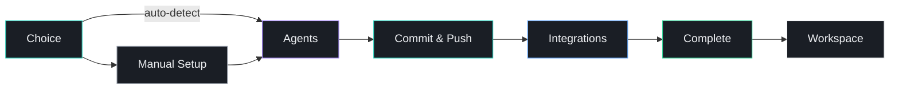
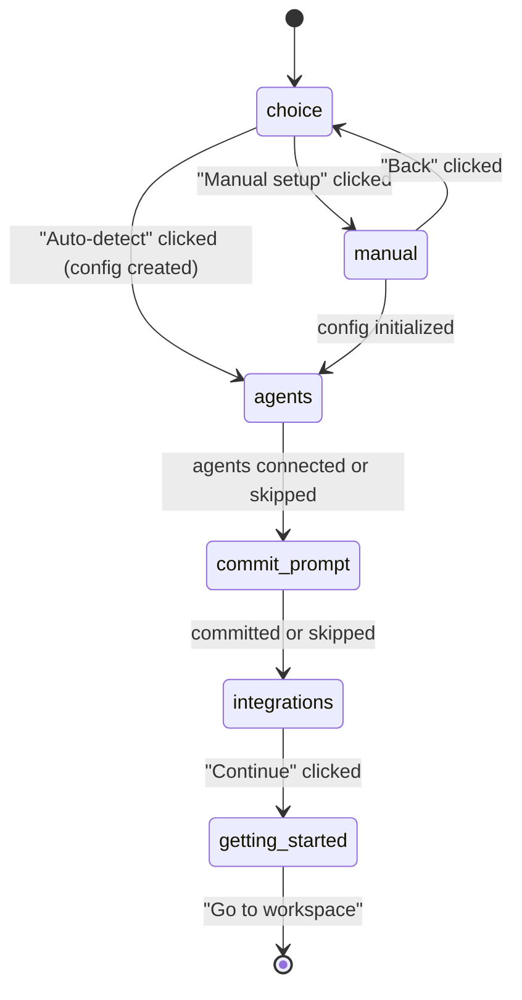
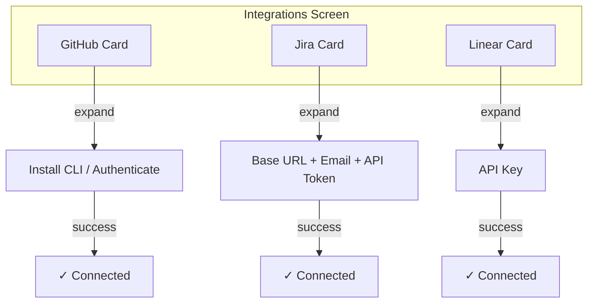
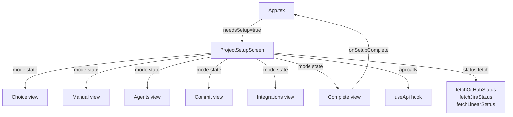

# Setup Flow

## Overview

When a project is opened for the first time (no `.dawg/config.json` exists), dawg presents a multi-step setup wizard. The wizard guides users through project configuration, agent connections, git setup, and integration linking before dropping them into the main workspace.

The setup flow is implemented in `src/ui/components/ProjectSetupScreen.tsx` as a single component with a `SetupMode` state machine.

---

## Flow Diagram



---

## State Machine



---

## Steps

### 1. Choice (`choice`)

**Purpose:** Let the user choose between automatic and manual configuration.

| Element | Description |
|---|---|
| Auto-detect | Detects package manager, start/install commands, and base branch from the project. Creates config immediately and advances to Agents. |
| Manual setup | Opens the manual config form. |
| Remember choice | Optional checkbox that persists the preference for future projects (Electron only). |

On mount, the component calls `api.detectConfig()` to pre-fill detected values shown under the auto-detect option.

### 2. Manual Setup (`manual`)

**Purpose:** Let the user review and customize detected settings.

**Core fields:**
- Base branch (e.g., `origin/main`)
- Start command (e.g., `pnpm dev`)
- Install command (e.g., `pnpm install`)

**Advanced fields** (behind "Show all options" toggle):
- Project directory (subdirectory for running commands)
- Local issue prefix (e.g., `LOCAL`)
- Auto-install dependencies toggle

Submitting calls `api.initConfig()` and advances to Agents.

### 3. Agents (`agents`)

**Purpose:** Connect MCP integration to AI coding agents (Claude, Cursor, Windsurf).

Each agent shows **Global** and **Project** scope toggles. The user selects which agents to connect, then clicks "Connect Agents" to apply. Calls `api.setupMcpAgent()` / `api.removeMcpAgent()` for each change.

Can be skipped with "Skip for now".

### 4. Commit & Push (`commit-prompt`)

**Purpose:** Commit and push the `.dawg/config.json` and `.dawg/.gitignore` files so the config is available in all worktrees.

Handles three GitHub CLI states:
- **Not installed** -- offers to install via Homebrew with device-flow auth
- **Installed but not authenticated** -- starts device-flow login
- **Ready** -- shows files to commit and an editable commit message

Polls every 2 seconds during device-flow authentication. Can be skipped.

### 5. Integrations (`integrations`)

**Purpose:** Connect external services inline during setup. Shows expandable cards for GitHub, Jira, and Linear.



**Card behavior:**
- Each card shows name, icon, description, and connection status.
- Clicking a card expands it to reveal the inline setup form.
- Only one card can be expanded at a time.
- Connected cards show a green checkmark and connected account info.

**GitHub setup** mirrors the commit-prompt step's GitHub CLI handling (install, auth, device-flow polling).

**Jira setup** collects base URL, email, and API token. Includes a "Create" link to Atlassian's API token page.

**Linear setup** collects an API key. Includes a "Create" link to Linear's API key page.

The "Continue" button advances regardless of how many (or few) integrations are connected. A note reminds users they can always connect later from the Integrations panel.

### 6. Complete (`getting-started`)

**Purpose:** Confirm setup is done and transition to the workspace.

Shows a success message with a summary of connected integrations (as colored pills) and a single "Go to workspace" button.

---

## Component Architecture



All six views are rendered by `ProjectSetupScreen` based on the `mode` state variable. There are no sub-components -- each view is an inline conditional return.

---

## Props

```typescript
interface ProjectSetupScreenProps {
  projectName: string | null;       // displayed in the header
  onSetupComplete: () => void;      // called when user finishes setup
  onRememberChoice?: (choice: 'auto' | 'manual') => void;  // Electron: persist preference
}
```

---

## API Endpoints Used

| Step | Endpoint | Purpose |
|---|---|---|
| Choice / Manual | `GET /api/config/detect` | Detect config values |
| Choice / Manual | `POST /api/config/init` | Create config |
| Agents | `GET /api/mcp/status` | Current agent MCP status |
| Agents | `POST /api/mcp/:agent/:scope/setup` | Connect an agent |
| Agents | `DELETE /api/mcp/:agent/:scope` | Disconnect an agent |
| Commit | `GET /api/github/status` | GitHub CLI/auth status |
| Commit | `POST /api/github/install` | Install gh CLI + start auth |
| Commit | `POST /api/github/login` | Start device-flow login |
| Commit | `POST /api/config/commit-setup` | Commit & push .dawg files |
| Integrations | `GET /api/github/status` | GitHub status |
| Integrations | `GET /api/jira/status` | Jira connection status |
| Integrations | `GET /api/linear/status` | Linear connection status |
| Integrations | `POST /api/jira/setup` | Connect Jira |
| Integrations | `POST /api/linear/setup` | Connect Linear |

---

## Skip Behavior

Every step after Choice can be skipped:

| Step | Skip action | What happens |
|---|---|---|
| Agents | "Skip for now" | Advances to Commit |
| Commit | "Skip for now" | Advances to Integrations |
| Integrations | "Continue without integrations" | Advances to Complete |

Skipped steps can always be completed later from the corresponding panel in the main workspace (Integrations panel, Agents tab in Configuration, etc.).
